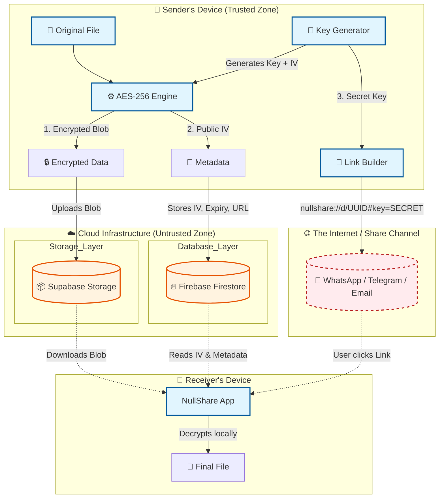
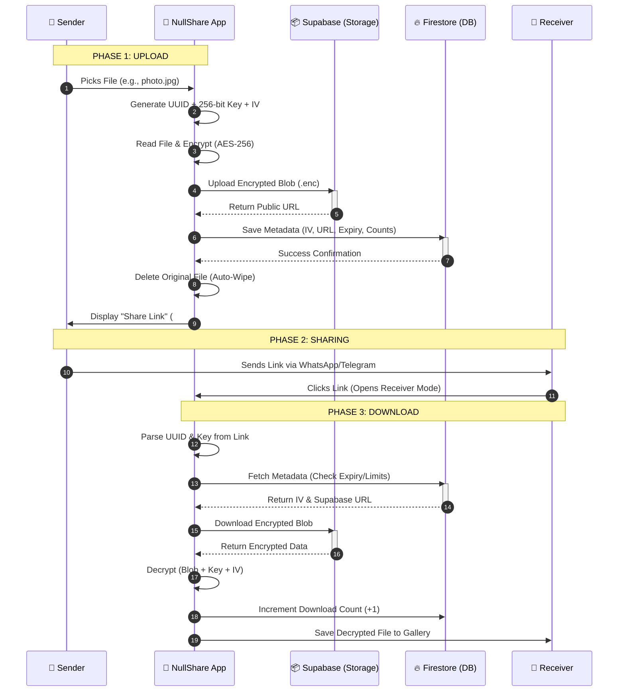

# 🔐 NullShare  
### Zero-Knowledge Encrypted File Sharing App

**NullShare** is a secure, ephemeral file-sharing application built with **React Native**.  
It follows a **Zero-Knowledge architecture**, meaning the server never sees the file contents or the decryption key.

All files are **encrypted locally on the user’s device before upload** and can only be decrypted by the recipient using a unique share link.

<p align="center">
  
</p>

---

## ✨ Features

- **🛡️ End-to-End Encryption**  
  Files are encrypted on the client side using **AES-256**, with a unique key generated for every transfer.

- **👻 Zero-Knowledge Privacy**  
  The decryption key exists *only* inside the share link (`#key=...`) and is never stored or transmitted to the server.

- **☁️ Hybrid Cloud Architecture**
  - **Storage:** Supabase (stores encrypted blobs only)
  - **Metadata:** Firebase Firestore (UUID, expiry time, download limits)

- **🗑️ Auto Self-Destruct**  
  Files are removed from the sender’s device immediately after upload.

- **📦 Native Android Support**  
  Custom Android APK with intent filters for direct file sharing.

- **🚀 Smart UI**  
  Real-time upload progress, native share sheet integration, and clean UX.

---
## ✨ Architecture Diagram 

---

## 🛠️ Tech Stack

- **Framework:** React Native (Expo SDK 50+)
- **Language:** JavaScript (ES6+)
- **Database:** Firebase Firestore
- **Storage:** Supabase Storage
- **Cryptography:** `crypto-js` (AES-256), `expo-crypto`
- **File Handling:** `expo-file-system`

---
## End-to-End Workflow (Sequence Diagram)

---

## 🚀 Installation & Setup

### 1️⃣ Clone the Repository

```bash
git clone https://github.com/pugazh342/NullShare.git
cd NullShare
````

---

### 2️⃣ Install Dependencies

```bash
npm install
```

---

### 3️⃣ Configure API Keys

> ⚠️ **Note:** You must create your own Firebase and Supabase projects.

---

#### 🔥 Firebase Configuration

Create a file named **`firebaseConfig.js`** in the root directory:

```javascript
import { initializeApp } from "firebase/app";
import { getFirestore } from "firebase/firestore";

const firebaseConfig = {
  apiKey: "YOUR_API_KEY",
  authDomain: "your-app.firebaseapp.com",
  projectId: "your-app",
  storageBucket: "your-app.appspot.com",
  messagingSenderId: "...",
  appId: "..."
};

const app = initializeApp(firebaseConfig);
export const db = getFirestore(app);
```

---

#### 🟢 Supabase Configuration

Create **`src/supabaseConfig.js`**:

```javascript
import { createClient } from "@supabase/supabase-js";

const supabaseUrl = "https://your-project.supabase.co";
const supabaseKey = "YOUR_SUPABASE_ANON_KEY";

export const supabase = createClient(supabaseUrl, supabaseKey);
```

---

### 4️⃣ Run the App

Start the Metro bundler:

```bash
npx expo start
```

* Press **`a`** to launch Android Emulator
* Or scan the QR code using **Expo Go** on a real device

---

## 📱 Building the APK (Android)

This project uses **EAS Build**.

### Install EAS CLI

```bash
npm install -g eas-cli
```

### Login to EAS

```bash
eas login
```

### Build APK

```bash
eas build -p android --profile preview
```

---

## 🔒 Security Architecture

1. Sender selects a file
2. App generates:

   * Random **UUID**
   * Secure **256-bit encryption key**
3. File is encrypted locally:

   ```text
   AES.encrypt(file, key)
   ```
4. Encrypted blob → **Supabase Storage**
5. Metadata (UUID, IV, expiry) → **Firestore**
6. Shareable link generated:

   ```text
   nullshare://d/UUID#key=KEY
   ```
7. Receiver opens link
8. App fetches encrypted blob + metadata
9. File is decrypted locally on the device

---

## 📄 License

This project is licensed under the **MIT License**.
See the `LICENSE` file for more details.

---

## ❤️ Author

Built with passion by **Pugazhmani. K**

